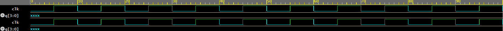

# 4-bit-synchronous-counter
verilog implementation of a 4-bit synchronous counter
# 4-bit Synchronous Counter

## Description

A 4-bit Synchronous Counter designed using Verilog HDL. The project includes design code, testbench, and simulation waveform to verify counter operation in digital systems.

## Features

* 4-bit binary counting
* Clock-based operation
* Verilog HDL implementation
* Testbench verification

## Files

* counter.v : Design code
* counter_tb.v : Testbench code
* counter_waveform.png : Simulation waveform

## Tools Used

* Verilog HDL
* EDA Playground / ModelSim / Vivado

## Simulation Result

## Author

Manasa Mytri
